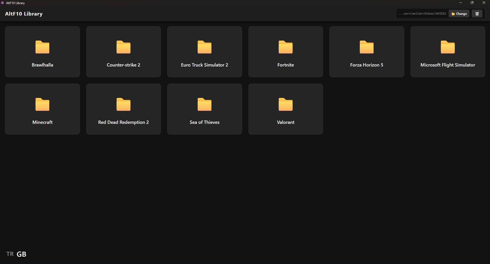
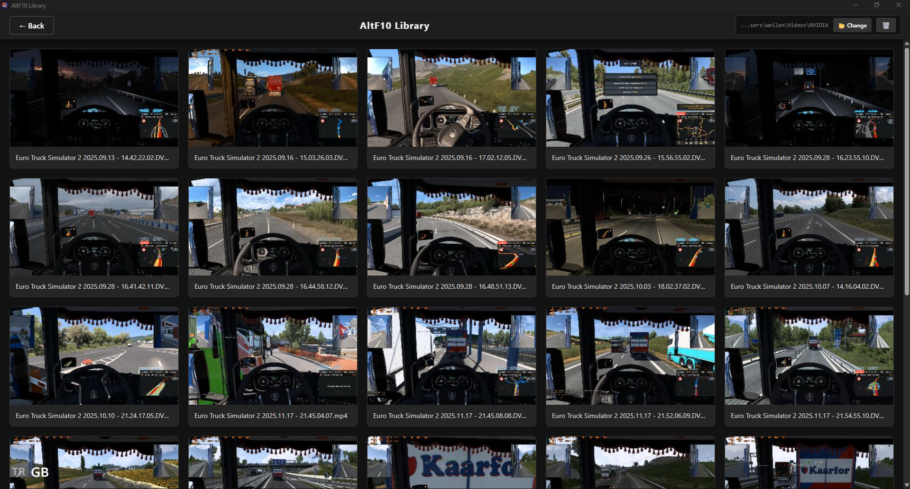

# AltF10 Library 🎮

  [](LICENSE)

**AltF10 Library** is a modern desktop application developed to organize, watch, and manage game recordings (DVR), clips, and screenshots. It is specifically designed to seamlessly process and preview next-generation recordings in **AV1** format.

## 🌟 Features

* **🛡️ AV1 & DVR Support:** It uses browser-based "Frontend Capture" technology to generate 100% stable thumbnails (previews) even for the most challenging formats.
* **⚡ Smart Video Compression:** Compress your videos to save space without losing quality.
    * **Multi-Codec Support:** **AV1**, **HEVC**, **H.264**, and **x264** (CPU).
    * **Smart History:** The app remembers compressed files and skips them in future batch processes to prevent re-compression.
    * **Single or Batch:** Compress a specific video or an entire folder at once.
* **📂 Dynamic Library Management:** You can select and change your video folder directly within the application.
* **⚡ Smart Cache System:** Generated images are saved locally and are not reloaded repeatedly. Can be cleared with a single click when needed.
* **✏️ "Lock-Breaking" Renaming:** Allows you to rename files without getting "File in use" errors by automatically releasing system resources, even if the video is playing in the background.
* **🎥 Embedded Player:** Full-screen video player and a modern interface.
* **🖼️ Image Viewer:** Supports not only videos but also `.jpg` and `.png` screenshots.
* **🎨 Modern Interface:** Dark Mode, responsive grid structure and stylish animations.

## 🛠️ Technologies Used

* **Electron:** Desktop container and file system (FS) operations.
* **React:** User interface and state management.
* **FFmpeg:** Used strictly for video compression and optimization tasks.
* **Node.js:** Backend logic.
* **HTML5 Canvas:** For converting video frames into images.

## 🚀 Installation and Running

Follow these steps to develop or run this project on your computer:

### 1. Clone the Project
```bash
git clone https://github.com/arda-ceylan/altf10-lib.git
cd altf10-lib
```

### 2. Install Dependencies
```bash
npm install
```

### 3. Start in Developer Mode
Starts both the React server and the Electron window simultaneously.
```bash
npm run electron:dev
```

### 4. Build the Application
Creates an .exe file for Windows.
```bash
npm run electron:build
```

## ⚙️ How It Works (Technical Detail)
**Thumbnail Generation**
Traditional methods using FFmpeg often crashed with "Code 69" or "Heap Corruption" errors, especially with AV1 encoded game recordings containing corrupt headers.

### 🎥 This project implements a **"Frontend Capture"** method:

* The application loads the video into an invisible <video> tag in the background.

* It seeks to the 5th second (or a specific frame).

* It draws the current frame onto a <canvas> element.

* The drawn frame is converted to Base64 format and sent to the Electron (Main Process).

* Electron saves this data to the disk as a .jpg file.

This ensures thumbnails are generated smoothly in every scenario where Chrome can play the video.


### ✏️ The "Lock-Breaking" Mechanism

* The app triggers a global pause on all `<video>` elements.

* It strips the `src` attribute from the active player.

* It calls `.load()` on the video element. This forces the Chromium engine to release the file handle immediately.

* The fs.rename operation is then executed safely.

### Smart Compression Pipeline

* **Engine:** Uses ffmpeg spawned as a child process.
* **Hardware Acceleration:** Defaults to NVENC (av1_nvenc, hevc_nvenc) for NVIDIA cards for maximum speed.
* **Process:**
    * Checks compress_history.json to see if the file was already processed.

    * Calculates dynamic bitrate/quality based on resolution (1080p / 1440p / 2160p).

    * Compresses to a temporary folder (temp/).

    * On success, replaces the original file and updates the history log.

    * Cleanup: Automatically deletes temporary files and folders after the operation.

## 📂 Project Structure

```
altf10-library/
├── bin/                 # FFmpeg binary files
├── public/              # Static assets (icons, manifest)
├── src/
│   ├── App.jsx          # Main application logic & state management
│   ├── App.css          # Global styles, grid layout, animations
│   └── main.jsx         # React entry point
├── electron.js          # Electron Main Process (FS, IPC, Config)
├── package.json         # Scripts and dependencies
└── README.md            # Documentation
```

## 📝 License
* This project is licensed under the Apache License 2.0 - see the [LICENSE](LICENSE) file for details.
* This project bundles **FFmpeg** binaries for video processing. FFmpeg is a trademark of Fabrice Bellard, originator of the FFmpeg project, and is licensed under the **LGPLv2.1** (or **GPLv2** depending on the build). For more information, visit [ffmpeg.org](https://ffmpeg.org).

## 🖼️ Some Screenshots


